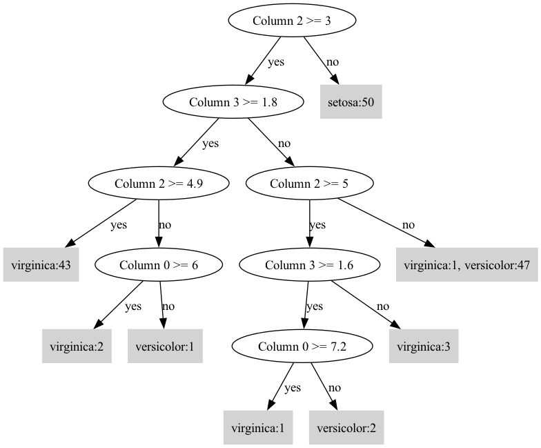

# Python Decision Tree

A from-scratch implementation of a CART (Classification and Regression Tree) algorithm in Python.

This script can build a decision tree from a CSV file, prune it, classify new data (including handling missing values), and visualize the resulting tree using Graphviz.

## Prerequisites

This project requires **Graphviz** to be installed on your system to render the decision tree images.

-   **macOS (using Homebrew):**
    ```bash
    brew install graphviz
    ```
-   **Debian/Ubuntu (using APT):**
    ```bash
    sudo apt-get install graphviz
    ```
-   **Windows (using Chocolatey):**
    ```bash
    choco install graphviz
   

## Installation

1.  Create a virtual environment and install the required Python packages from `requirements.txt`.

    ```bash
    # Create the virtual environment
    uv venv

    # Activate the environment (optional, as `uv run` handles it)
    # source .venv/bin/activate

    # Install Python dependencies
    uv pip install -r requirements.txt
    ```

## Usage

Run the script from your terminal, specifying the dataset and desired options.

``` bash
uv run decision_tree.py 2 --criterion entropy --plot tree_iris.png
```

* 2: Use the Iris dataset example (Example 1 uses the TBC dataset).
* --criterion: The impurity measure to use (entropy or gini). Defaults to entropy.
* --plot: (Optional) The output file path to save the visualized tree image.

Example Output:
``` text
Column 2 >= 3?
yes -> Column 3 >= 1.8?
    yes -> Column 2 >= 4.9?
        yes -> virginica: 43
        no  -> Column 0 >= 6?
            yes -> virginica: 2
            no  -> versicolor: 1
    no  -> Column 2 >= 5?
        yes -> Column 3 >= 1.6?
            yes -> Column 0 >= 7.2?
                yes -> virginica: 1
                no  -> versicolor: 2
            no  -> virginica: 3
        no  -> Column 3 >= 1.7?
            yes -> virginica: 1
            no  -> versicolor: 47
no  -> setosa: 50
A branch was pruned: gain = 0.146094
Column 2 >= 3?
yes -> Column 3 >= 1.8?
    yes -> Column 2 >= 4.9?
        yes -> virginica: 43
        no  -> Column 0 >= 6?
            yes -> virginica: 2
            no  -> versicolor: 1
    no  -> Column 2 >= 5?
        yes -> Column 3 >= 1.6?
            yes -> Column 0 >= 7.2?
                yes -> virginica: 1
                no  -> versicolor: 2
            no  -> virginica: 3
        no  -> versicolor: 47, virginica: 1
no  -> setosa: 50

--- Classification Examples ---
----------------------------------------
Input Sample: [6.0, 2.2, 5.0, 1.5]
--> Predicted Class: 'virginica'

Detailed Scores (Leaf Node Counts / Weights):
    - virginica   : 3
----------------------------------------
----------------------------------------
Input Sample: [None, None, None, 1.5]
--> Predicted Class: 'setosa'

Detailed Scores (Leaf Node Counts / Weights):
    - setosa      : 26.2184
    - versicolor  : 21.0397
    - virginica   : 0.5316
----------------------------------------
Decision tree exported to tree_iris.png
```

|  |
| --- |

