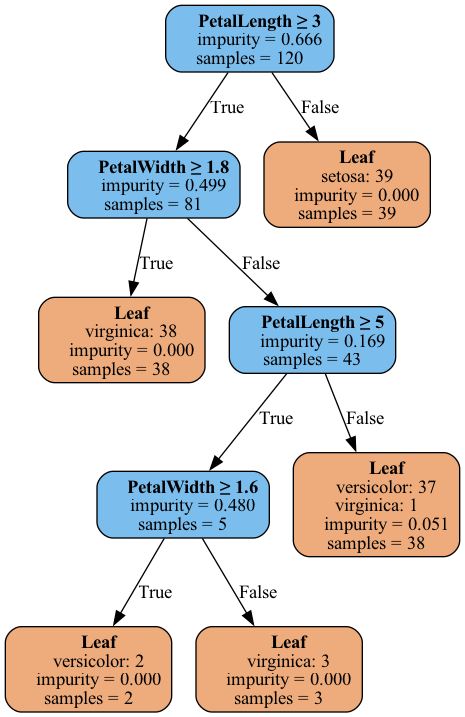

# Python Decision Tree

A from-scratch implementation of a CART (Classification and Regression Tree) algorithm in Python. This repository provides a decision_tree.py library and a command-line script, eval_tree.py, for training, evaluating, and visualizing models on CSV datasets.

## Features

* Builds a decision tree from a CSV dataset.
* Supports both **Gini Impurity** and **Information Gain (Entropy)** as splitting criteria.
* Implements two types of pruning to prevent overfitting:
  * Pre-pruning: `max_depth` and `min_samples_split`.
  * post-pruning: Based on a minimum gain threshold.
* Classifies new data samples, including robust handling of missing feature values (e.g., `?`).
* Provides three robust evaluation methods:
  * Simple train/test split.
  * K-Fold Cross-Validation for a stable performance estimate.
  * Evaluation ona separate, pre-defined test file.
* Visualises the trained decision tree into an image file (.png, .svg, etc.) using Graphviz.


## Prerequisites

This project requires **Graphviz** to be installed on your system to render the decision tree images.

-   **macOS (using Homebrew):**
    ```bash
    brew install graphviz
    ```
-   **Debian/Ubuntu (using APT):**
    ```bash
    sudo apt-get install graphviz
    ```
-   **Windows (using Chocolatey):**
    ```bash
    choco install graphviz
   

## Installation

Create a virtual environment and install the required Python packages from `requirements.txt`:

    ```bash
    uv venv
    uv pip install -r requirements.txt
    ```

## Usage

The primary script for training and evaluation is ```eval_tree.py```.
Run the script from your terminal, specifying the dataset and the desired options:

``` text
positional arguments:
  file_path             Path to the training CSV dataset file.

options:
  -h, --help            show this help message and exit
  --max_depth MAX_DEPTH
                        Maximum depth of the tree. Default: None (unlimited)
  --min_samples_split MIN_SAMPLES_SPLIT
                        Minimum number of samples required to split a node (default: 2)
  --test_file TEST_FILE
                        Optional path to a separate CSV test dataset file. If provided, overrides split/k-fold.
  -s SPLIT_RATIO, --split_ratio SPLIT_RATIO
                        Proportion for training in a simple split. Default: 0.8
  -c {entropy,gini}, --criterion {entropy,gini}
                        The splitting criterion to use. Default: 'gini'
  -p PRUNE, --prune PRUNE
                        Minimum gain to keep a branch. Default: 0.0 (no pruning).
  --plot FILE           Export the decision tree as a Graphviz image (e.g. tree.png or tree.svg)
  -k K_FOLDS, --k_folds K_FOLDS
                        Number of folds for k-fold cross-validation. If > 1, this overrides --split_ratio. Default: 0
```

## Examples

### 1. Simple Split with Pruning and Visualisation

Train on the Iris dataset using an 80/20 split, apply post-pruning (--prune), and save a visualisation of the
trained tree.

``` bash
uv run eval_tree.py data/fishiris.csv --prune 0.1 --split_ratio 0.8 --plot tree_iris.png
```
Example Output:
```text
Loading dataset from: data/fishiris.csv...
Dataset loaded successfully with 150 rows.

Performing a simple train/test split...
Data split into 120 training samples and 30 test samples.
------------------------------
Training the decision tree model (criterion: gini)...
Model training complete.
Pruning the tree with min_gain = 0.1...
A branch was pruned: gain = 0.051247
Pruning complete.
Decision tree exported to tree_iris.png

Evaluating model accuracy on the test set...

--- Evaluation Result ---
Model Accuracy: 93.33%
-----------------------------
```

|  |
| --- |

### 2. 10-Fold Cross Validation on the Wine Quality Dataset

Perform a robust evaluation on the Wine Quality dataset [3], replicating the methodology from the original paper.
The original paper reported an accuracy of 62% for red wine and 65% for white wine (SVM classifier).

``` bash
uv run eval_tree.py data/winequality-red.csv -k 10
```

Example Output:
```
Loading dataset from: data/winequality-red.csv...
Dataset loaded successfully with 1599 rows.

Performing 10-fold cross-validation...

--- Fold 1/10 ---
Training on 1440 samples, testing on 159 samples.
Fold 1 Accuracy: 62.26%

--- Fold 2/10 ---
Training on 1440 samples, testing on 159 samples.
Fold 2 Accuracy: 63.52%

...[snip]...

--- Fold 10/10 ---
Training on 1431 samples, testing on 168 samples.
Fold 10 Accuracy: 64.88%

==============================
Cross-Validation Summary
==============================
Average Accuracy: 63.78%
Standard Deviation: 4.34%
==============================
```

### 3. Pre-Pruning with a separate Test Set (Adult Dataset)

Train on the large Adult dataset, which has a pre-defined train/test split and contains missing values. Use
pre-pruning (`--max_depth` and `--min_samples_split`) to control tree size and prevent overfitting.

``` bash
uv run eval_tree.py data/adult_train.csv --test_file data/adult_test.csv --min_samples_split 10 --max_depth 10
```

Example Output:
```
Loading training dataset from: data/adult_train.csv...
Training set: 32561 rows
Loading test dataset from: data/adult_test.csv...
Test set: 16281 rows

Training decision tree (criterion: gini)...
Model training complete.

Evaluating model accuracy on the external test set...

--- Evaluation Result ---
Model Accuracy: 86.03%
```

## References

1. [TBC Dataset](https://www.kaggle.com/datasets/tawsifurrahman/tuberculosis-tb-chest-xray-dataset)
2. [Iris Dataset](https://archive.ics.uci.edu/dataset/53/iris)
3. [Wine Quality Dataset](https://archive.ics.uci.edu/dataset/186/wine+quality)
4. [Modeling wine preferences by data mining from physicochemical properties, Paulo Cortez et al.](https://repositorium.sdum.uminho.pt/bitstream/1822/10029/1/wine5.pdf)
5. [Adult (1994 Census) Dataset](https://archive.ics.uci.edu/dataset/2/adult)

